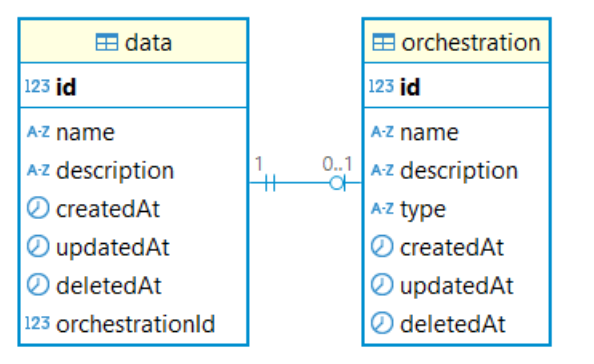
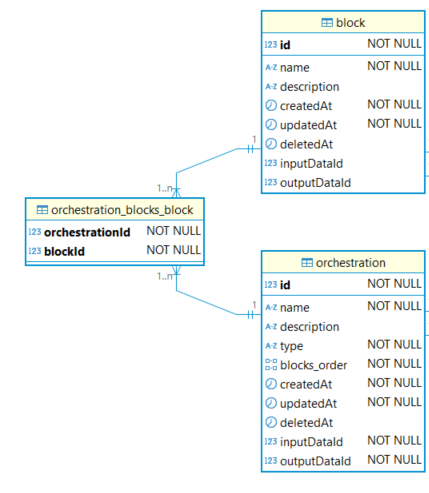
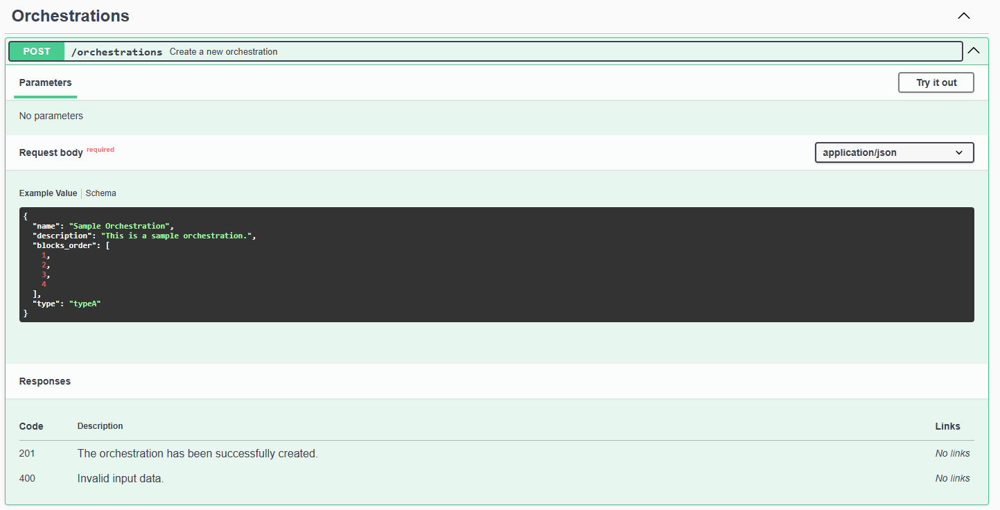

<p align="center">
  <a href="http://nestjs.com/" target="blank"></a>
</p>

[circleci-image]: https://img.shields.io/circleci/build/github/nestjs/nest/master?token=abc123def456
[circleci-url]: https://circleci.com/gh/nestjs/nest

  <p align="center">A progressive <a href="http://nodejs.org" target="_blank">Node.js</a> framework for building efficient and scalable server-side applications.</p>
    <p align="center">
<a href="https://www.npmjs.com/~nestjscore" target="_blank"></a>
<a href="https://www.npmjs.com/~nestjscore" target="_blank"></a>
<a href="https://www.npmjs.com/~nestjscore" target="_blank"></a>
<a href="https://circleci.com/gh/nestjs/nest" target="_blank"></a>
<a href="https://coveralls.io/github/nestjs/nest?branch=master" target="_blank"></a>
<a href="https://discord.gg/G7Qnnhy" target="_blank"></a>
<a href="https://opencollective.com/nest#backer" target="_blank"></a>
<a href="https://opencollective.com/nest#sponsor" target="_blank"></a>
  <a href="https://paypal.me/kamilmysliwiec" target="_blank"></a>
    <a href="https://opencollective.com/nest#sponsor"  target="_blank"></a>
  <a href="https://twitter.com/nestframework" target="_blank"></a>
</p>
  <!--[](https://opencollective.com/nest#backer)
  [](https://opencollective.com/nest#sponsor)-->

## License

Nest is [MIT licensed](https://github.com/nestjs/nest/blob/master/LICENSE).

## Description

A personal workflow for developing backend database using Typescript and NestJS.

## Setup

### Project Setup

```sh
# Install NestJS CLI:
npm i -g @nestjs/cli

# https://docs.nestjs.com/cli/usages#nest-new
# Create a new NestJS project on current folder:
nest new .
```

### Compile and run the project

```sh
# development
npm run start

# watch mode
npm run start:dev
```

### Run tests

```sh
# unit tests
npm run test

# e2e tests
npm run test:e2e

# test coverage
npm run test:cov
```

# Workflow

## 1. Define Entities relationship:

[Diagram]

## 2. Install dependencies

```sh
npm install @nestjs/typeorm typeorm pg
npm install class-validator class-transformer
npm install @nestjs/config
npm install @nestjs/swagger swagger-ui-express
npm install cross-env --save-dev
```

## 3. Configure Database

we use Podman Compose.

Create a `podman-compose.yml` in root directory:

```yaml
version: '3.8'

services:
  postgres:
    image: docker.io/library/postgres:latest
    container_name: postgres_workflow
    hostname: postgres_workflow
    ports:
      - '5430:5432'
    environment:
      POSTGRES_USER: admin
      POSTGRES_PASSWORD: admin
      POSTGRES_DB: mydb
    volumes:
      - postgres_workflow_data:/var/lib/postgresql/data
    restart: always

volumes:
  postgres_workflow_data:
```

Run the Container:

```sh
podman compose --file .\podman-compose.yml up --build -d
```

Stop the Container:

```sh
podman compose --file .\podman-compose.yml down
```

Test the Connection:

```sh
psql -h localhost -p 5430 -U admin -d mydb
```

## 4. Set Up Configuration Management

Create `env.development` `.env.test` `.env.production` files:

```env
DATABASE_HOST=localhost
DATABASE_PORT=5430
DATABASE_USER=admin
DATABASE_PASSWORD=admin
DATABASE_NAME=mydb
```

Add imports `app.module.ts`:

```typescript
import { ConfigModule } from '@nestjs/config';

@Module({
  //https://docs.nestjs.com/techniques/configuration
  imports: [
  ConfigModule.forRoot({
    isGlobal: true,  // Makes the config available globally
    envFilePath: [`.env.${process.env.NODE_ENV}`, '.env'],  // Prioritizes specific, falls back to default
  }),
]
})
```

Specific commands in `package.json`:

```json
  "scripts": {
    "start": "cross-env NODE_ENV=development nest start",
    "start:dev": "cross-env NODE_ENV=development nest start --watch",
    "start:debug": "cross-env NODE_ENV=development nest start --debug --watch",
    "start:test": "cross-env NODE_ENV=test nest start",
    "start:prod": "cross-env NODE_ENV=production nest start",
    "test": "cross-env NODE_ENV=test jest",
    "test:watch": "cross-env NODE_ENV=test jest --watch",
    "test:cov": "cross-env NODE_ENV=test jest --coverage",
    "test:debug": "cross-env NODE_ENV=test node --inspect-brk -r tsconfig-paths/register -r ts-node/register node_modules/.bin/jest --runInBand",
    "test:e2e": "cross-env NODE_ENV=test jest --config ./test/jest-e2e.json"
  },
```

## 5. Configure Database Connection

Add imports in `app.module.ts`:

```typescript
import { TypeOrmModule } from '@nestjs/typeorm';
import { ConfigModule, ConfigService } from '@nestjs/config';

@Module({
  imports: [
    // https://docs.nestjs.com/techniques/database
    TypeOrmModule.forRootAsync({
      imports: [ConfigModule],
      inject: [ConfigService],
      useFactory: (configService: ConfigService) => ({
        type: 'postgres',
        host: configService.get<string>('DATABASE_HOST'),
        port: configService.get<number>('DATABASE_PORT'),
        username: configService.get<string>('DATABASE_USER'),
        password: configService.get<string>('DATABASE_PASSWORD'),
        database: configService.get<string>('DATABASE_NAME'),
        autoLoadEntities: true,
        synchronize: process.env.NODE_ENV !== 'production', // Disable sync in production
      }),
    }),
  ],
})


```

## 6. Set Up Swagger UI

Modify `main.ts`:

```typescript
import { DocumentBuilder, SwaggerModule } from '@nestjs/swagger';

async function bootstrap() {
  // ...
  //https://docs.nestjs.com/openapi/introduction
  const config = new DocumentBuilder()
    .setTitle('My API')
    .setDescription('API Documentation')
    .setVersion('1.0')
    .build();
  const document = SwaggerModule.createDocument(app, config);
  SwaggerModule.setup('api', app, document);
  // ...
}
```

> Open Swagger UI by http://localhost:3000/api

## 7. Create Module, Controller, Service, and Entities

```sh
# https://docs.nestjs.com/cli/usages#nest-generate
# use plural
nest generate resource orchestrations
```

## 8. Define Entities

Add imports in `orchestrations.module.ts`:

```typescript
import { TypeOrmModule } from '@nestjs/typeorm';
import { Orchestration } from './entities/orchestration.entity';

@Module({
  imports: [TypeOrmModule.forFeature([Orchestration])],
})
```

Edit entity in `src/orchestrations/entities/orchestration.entity.ts`:

```typescript
import { Entity, PrimaryGeneratedColumn } from 'typeorm';

// A minimal entity
@Entity()
export class Orchestration {
  @PrimaryGeneratedColumn() // auto-incremented primary key
  id: number;
}
```

Add Columns:

```typescript
@Entity()
export class Orchestration {
  @PrimaryGeneratedColumn()
  id: number;

  @Column({ unique: true }) // unique column need extra exception handling
  name: string;

  @Column({ nullable: true })
  description: string;

  @Column({ type: 'integer', array: true }) // if arrary, type need to be specified
  blocks_order: number[];

  @Column({
    type: 'enum', // necessary to add type for enum
    enum: OrchestrationType,
    default: OrchestrationType.TYPEA, // optional
  })
  type: OrchestrationType;

  @CreateDateColumn()
  createdAt: Date;

  @UpdateDateColumn()
  updatedAt: Date;

  @DeleteDateColumn()
  deletedAt: Date;
}
```

> More about Entity Columns: https://typeorm.io/entities#entity-columns

> More about Column Types: https://typeorm.io/entities#column-types

## 9. Define Relations

- ### Basic Concept

  - Owning Side:

    - The owning side of a relationship is the side that holds the foreign key column in the database
    - Only the owning side should use decorators like `@JoinColumn()` or `@JoinTable()`.

  - Inverse Side:

    - The inverse side refers to the side that doesn't hold the foreign key.

  - Unidirectional

  - Bidirectional

- ### OneToOne

  > Refer to https://typeorm.io/one-to-one-relations

    

  ```typescript
  // This is a standard exmaple, we did not follow this in the final code for some extra feature.
  // Parent, Inverse Side
  @Entity()
  export class Orchestration {
    // ...
    @OneToOne(() => Data, (data) => data.orchestration) // bidirectional relation
    data: Data;
  }

  // Child, Owning Side
  @Entity()
  export class Data {
    // ...
    @OneToOne(() => Orchestration, (orchestration) => orchestration.data)
    @JoinColumn() // suggest add JoinColumn() to Child, the FK will be added here
    orchestration: Orchestration;
  ```

- ### ManyToOne / OneToMany

  > Refer to https://typeorm.io/many-to-one-one-to-many-relations

  Similar to OneToOne, but no `@JoinColumn()` required.

  _One_ indicates the Parent (`@OneToMany()`), and _Many_ indicates the Child (`@ManyToOne()`).

  Foreign key will automatically added to the _Many_ (child) side

- ### ManyToMany

  > Refer to https://typeorm.io/many-to-many-relations

  

  ```typescript
  // Owning Side (although in ManyToMany relationship there is no a clear owning side)
  @Entity()
  export class Orchestration {
    // ...
    @ManyToMany(() => Block, (block) => block.orchestrations) // bidirectional relation
    @JoinTable() // suggest add JoinTable() to the owning side
    blocks: Block[];
  }

  // Inverse Side
  @Entity()
  export class Block {
    // ...
    @ManyToMany(() => Orchestration, (orchestration) => orchestration.blocks)
    orchestrations: Orchestration[];
  ```

- ### Relation Options

  > Refer to https://typeorm.io/relations#relation-options and https://typeorm.io/eager-and-lazy-relations

  - `eager: boolean (default: false)` - If set to true, the relation will always be loaded with the main entity when using find\* methods or QueryBuilder on this entity
  - `cascade: boolean | ("insert" | "update" | "remove" | "soft-remove" | "recover")[]. (default: false)` - If set to true, the related object will be inserted and updated in the database
  - `onDelete: "RESTRICT"|"CASCADE"|"SET NULL" (default: RESTRICT)` - specifies how foreign key should behave when referenced object is deleted
  - `nullable: boolean (default: true)` - Indicates whether this relation's column is nullable or not. By default it is nullable.
  - `orphanedRowAction: "nullify" | "delete" | "soft-delete" | "disable" (default: disable)`

## 10. Define API Endpoints

Define API Endpoints (Basic CRUD will be defined automatically by cli `nest g resource`):

```typescript
  @Post()
  create(@Body() createOrchestrationDto: CreateOrchestrationDto) {
    return this.orchestrationsService.create(createOrchestrationDto);
  }
```

Some details for routing REST API:

- @Param():
  ```typescript
  @Get(':id/:name')
  getUser(@Param() params: { id: string; name: string }) { // always return string by reading from url, add Pipes to convert it into number
    return `User ID: ${params.id}, Name: ${params.name}`;
  }
  ```
  Extracts both id and name from the URL (e.g., `/users/123/John`)
- @Query():

  ```typescript
  @Get()
  findAll(@Query() query: { page: string; limit: string }) {
    return `Page: ${query.page}, Limit: ${query.limit}`;
  }
  ```

  Extracts multiple query parameters (e.g., `/users?page=1&limit=10`).

- @Body():

  ```typescript
  @Post()
  createUser(@Body('name') name: string) {
    return `User Name: ${name}`;
  }
  ```

  Extracts only the `name` field from the request body. To extracts the entire body, use DTO

> More about request object: https://docs.nestjs.com/controllers#request-object

## 12. Setup Validation with Pipes and DTOs

### Build-in pipes: `ParseIntPipe` `ParseBoolPipe` `ParseArrayPipe` `ParseUUIDPipe`:

transfer string to the corresponding value, for exmaple:

```typescript
@Get(':id')
getUser(@Param('id', ParseIntPipe) id: number) { // convert id into int using Pipes
  return `User ID: ${id}`;
}
```

or do it manually

```typescript
@Get(':id')
getUser(@Param('id') id: string) {
  return `User ID: ${+id}`; // convert id into int manually
}
```

### DTO:

Set up `useGlobalPipes` in `main.ts`:

```typescript
async function bootstrap() {
  // ...
  // https://docs.nestjs.com/techniques/validation
  app.useGlobalPipes(
    new ValidationPipe({
      whitelist: true, // validator will strip validated (returned) object of any properties that do not use any validation decorators.
      forbidNonWhitelisted: true, // instead of stripping non-whitelisted properties validator will throw an exception.
      transform: true, // automatically transform payloads to be objects typed according to their DTO classes
    }),
  );
  // ...
}
```

create DTOs according to the entity:

given an orchestration entity:

```typescript
@Entity()
export class Orchestration {
  @PrimaryGeneratedColumn()
  id: number;

  @Column({ unique: true })
  name: string;

  @Column({ nullable: true })
  description: string;

  @Column({ type: 'integer', array: true })
  blocks_order: number[];

  @Column({
    type: 'enum',
    enum: OrchestrationType,
    default: OrchestrationType.TYPEA,
  })
  type: OrchestrationType;
}
```

`create-orchestration.dto.ts` should be:

```typescript
export class CreateOrchestrationDto {
  @IsNotEmpty()
  @IsString()
  name: string; // no contraints for unique

  @IsOptional()
  @IsString()
  description?: string; // do not forget ? sign

  @IsArray()
  @ArrayNotEmpty()
  blocks_order: number[];

  @IsEnum(OrchestrationType)
  @IsOptional()
  type?: OrchestrationType;
}
```

> class-validator: https://github.com/typestack/class-validator

> class-transformer: https://github.com/typestack/class-transformer

> tipps: AI can perform this task perfectly

## 13. Implement Service

Inject database Repository in `orchestrations.service.ts`:

```typescript
import { Orchestration } from './entities/orchestration.entity';
import { Repository } from 'typeorm';
import { InjectRepository } from '@nestjs/typeorm';

@Injectable()
export class OrchestrationsService {
  constructor(
    // injecting orchestration repository
    @InjectRepository(Orchestration)
    private orchestrationRepository: Repository<Orchestration>,
  ) {}

  // ...
}
```

Implement the service function:

```typescript
  async create(
    createOrchestrationDto: CreateOrchestrationDto,
  ): Promise<Orchestration> {  // Promise<> can be neglected because async function always return Promise
    const orchestration = this.orchestrationRepository.create(
      createOrchestrationDto,
    );
    return await this.orchestrationRepository.save(orchestration);
  }
```

> More details for async and await: https://typeorm.io/repository-api

## 14. Exception Handling

We need to verify that `name` is unique for exmaple, without error handling it returns:

```sh
{
  "statusCode": 500,
  "message": "Internal server error"
}
```

### Method 1: check the column name explicitly:

```typescript
async create(
  createOrchestrationDto: CreateOrchestrationDto,
): Promise<Orchestration> {
  // verify unique name
  if (
    await this.orchestrationRepository.findOne({
      where: { name: createOrchestrationDto.name },
    })
  ) {
    throw new BadRequestException('Orchestration name must be unique.');
  }

  // create orchestration
  const orchestration = this.orchestrationRepository.create(
    createOrchestrationDto,
  );
  return await this.orchestrationRepository.save(orchestration);
}
```

> More details for build-in HTTP execeoptions on https://docs.nestjs.com/exception-filters#built-in-http-exceptions

and it returns:

```sh
{
  "message": "Orchestration name must be unique.",
  "error": "Bad Request",
  "statusCode": 400
}
```

### Method 2: use the database error codes:

```typescript
async create(
  createOrchestrationDto: CreateOrchestrationDto,
): Promise<Orchestration> {
  // create orchestration
  const orchestration = this.orchestrationRepository.create(
    createOrchestrationDto,
  );

  try {
    return await this.orchestrationRepository.save(orchestration);
  } catch (error) {
    // check if it is a unique violation
    if (error.code === '23505') {
      throw new ConflictException('Unique Violation');
    }
    throw error; // go back to throw global exception filter
  }
}
```

> More postgresql error codes on https://www.postgresql.org/docs/current/errcodes-appendix.html

and it returns:

```sh
{
  "message": "Unique Violation",
  "error": "Conflict",
  "statusCode": 409
}
```

### Method 3: create a custom (global) exception filter `postgres-exception.filter.ts`:

```typescript
import {
  ArgumentsHost,
  Catch,
  ExceptionFilter,
  HttpStatus,
} from '@nestjs/common';
import { QueryFailedError } from 'typeorm';
import { Response } from 'express';

@Catch(QueryFailedError)
export class PostgresExceptionFilter implements ExceptionFilter {
  catch(
    exception: QueryFailedError & {
      code?: string;
      detail?: string;
      table?: string;
      constraint?: string;
    },
    host: ArgumentsHost,
  ) {
    const ctx = host.switchToHttp();
    const response = ctx.getResponse<Response>();

    // Only return status 400 bad request, can define more there
    const status = HttpStatus.BAD_REQUEST;

    response.status(status).json({
      statusCode: status,
      postgresCode: exception.code, // PostgreSQL code
      message: exception.detail || exception.message, // Detailed message
      table: exception.table, // Affected table
      constraint: exception.constraint, // Violated constraint
    });
  }
}
```

> More details for exception filter on https://docs.nestjs.com/exception-filters#exception-filters-1

register the filter locally in `orchestrations.controller.ts`:

```typescript
@Controller('orchestrations')
@UseFilters(PostgresExceptionFilter)
export class OrchestrationsController {
  //...
}
```

or globally in `main.ts`:

```typescript
async function bootstrap() {
  // ...
  // Register the global filter
  app.useGlobalFilters(new PostgresExceptionFilter());
  // ...
}
bootstrap();
```

now it returns:

```sh
{
  "statusCode": 400,
  "postgresCode": "23505",
  "message": "Key (name)=(Sample Orchestration) already exists.",
  "table": "orchestration",
  "constraint": "UQ_158a0156225d9eca72d62a8d66f"
}
```

## 15 Documentation Swagger

Document the API for Swagger UI

### Directly in API (using schema)

```typescript
@ApiOperation({ summary: 'Create a new orchestration' })
@ApiResponse({
  status: 201,
  description: 'The orchestration has been successfully created.',
})
@ApiResponse({ status: 400, description: 'Invalid input data.' })
@ApiBody({
  description: 'Some description',
  examples: {
    example1: {
      summary: 'Sample example',
      value: {
        name: 'Sample Orchestration',
        description: 'This is a sample orchestration.',
        blocks_order: [1, 2, 3, 4],
      },
    },
  },
})
@Post()
create(@Body() createOrchestrationDto: CreateOrchestrationDto) {
  return this.orchestrationsService.create(createOrchestrationDto);
}
```

> More details onhttps://docs.nestjs.com/openapi/decorators

### Combind with DTO (suggested)

remove the examples in `ApiBody()` and add examples in dto:

```typescript
export class CreateOrchestrationDto {
  @ApiProperty({
    example: 'Sample Orchestration',
  })
  @IsNotEmpty()
  @IsString()
  name: string;

  @ApiProperty({
    example: 'This is a sample orchestration.',
    required: false,
  })
  @IsOptional()
  @IsString()
  description?: string;

  @ApiProperty({
    example: [1, 2, 3, 4],
  })
  @IsArray()
  @ArrayNotEmpty()
  blocks_order: number[];

  @ApiProperty({
    enum: OrchestrationType,
    required: false,
    example: OrchestrationType.TYPEA,
  })
  @IsEnum(OrchestrationType)
  @IsOptional()
  type?: OrchestrationType;
}
```

  

## 16. Implement Unit Tests

## 17. Implement E2E Tests
